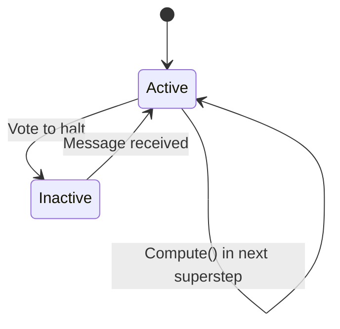

# Pregel 论文精读：大规模图处理系统

> **原始论文**：Malewicz et al., *Pregel: A System for Large-Scale Graph Processing*, SIGMOD 2010
> **作者**：Grzegorz Malewicz, Matthew H. Austern, Aart J. C. Bik, James C. Dehnert, Ilan Horn, Naty Leiser, Grzegorz Czajkowski（Google Inc.）
> **PDF**：见 [raw/papers/pregel/pregel-malewicz-sigmod2010.pdf](../../raw/papers/pregel/pregel-malewicz-sigmod2010.pdf)

> **TL;DR**
> - **本文讲什么**：Google 在 2010 年提出的**以顶点为中心**（vertex-centric）的大规模图计算系统，把"亿级顶点、万亿级边"的图算法跑在数千台机器上。
> - **核心思想**：一切计算分解为一系列**超步**（superstep），同一超步里所有活跃顶点**并行**跑用户函数 `Compute()`，顶点之间**只通过消息**通信，超步之间全局同步。
> - **为什么我要读**：LangGraph 的运行时模型直接借用了 Pregel 的 BSP + 消息传递。读完本篇你就知道为什么 LangGraph 的"图"是这个形状、为什么 reducer 必须可结合、为什么并行 fan-out 要 `Send`。
> - **读到什么程度够用**：§1（背景）→ §2（计算模型）→ §3（API）必读；§4 实现 / §5 应用 / §6 实验按兴趣。

---

## 1. 名词速查

| 英文术语 | 中文 | 一句话解释 |
|---------|------|-----------|
| **Bulk Synchronous Parallel (BSP)** | 批量同步并行 | Valiant 1990 提出的并行计算模型；Pregel 沿用 |
| **Superstep** | 超步 | 一次全局同步迭代；所有活跃顶点并行计算一次 |
| **Vertex-centric** | 以顶点为中心 | 用户写"一个顶点的逻辑",系统组合成全局计算 |
| **Compute()** | 顶点计算函数 | 用户重写的虚函数,每个超步在每个活跃顶点上调用一次 |
| **Vote to halt** | 投票停止 | 顶点声明自己"无事可做",进入 inactive 状态 |
| **Active / Inactive** | 活跃 / 非活跃 | 顶点状态机两态;收到消息会自动激活 |
| **Combiner** | 合并器 | 把多条发往同一顶点的消息合并(满足交换律 + 结合律) |
| **Aggregator** | 聚合器 | 跨顶点全局规约;每超步汇总一次,下一超步可见 |
| **Topology Mutation** | 拓扑变更 | 运行中增删顶点 / 边 |
| **Master / Worker** | 主 / 从 | Master 协调,Worker 持有图分区并执行 Compute() |
| **Checkpoint** | 检查点 | 超步开始时把分区状态落到持久存储,用于容错 |
| **Confined recovery** | 受限恢复 | 失败后只重算丢失分区(需算法是确定性的) |

---

## 2. 摘要（逐句对译）

> **原文（英）**：Many practical computing problems concern large graphs. Standard examples include the Web graph and various social networks. The scale of these graphs—in some cases billions of vertices, trillions of edges—poses challenges to their efficient processing.

> **译**：很多实际计算问题都涉及大型图。典型例子包括 Web 图和各类社交网络。这些图的规模——某些情况下达到数十亿顶点、数万亿边——给高效处理带来了挑战。

> **原文**：In this paper we present a computational model suitable for this task. Programs are expressed as a sequence of iterations, in each of which a vertex can receive messages sent in the previous iteration, send messages to other vertices, and modify its own state and that of its outgoing edges or mutate graph topology.

> **译**：本文提出一个适合该任务的计算模型。程序被表达为**一系列迭代**,在每次迭代中,**一个顶点可以接收上一次迭代发来的消息、向其他顶点发送消息、修改自身状态以及出边状态,还可以变更图拓扑**。

> **原文**：This vertex-centric approach is flexible enough to express a broad set of algorithms. The model has been designed for efficient, scalable and fault-tolerant implementation on clusters of thousands of commodity computers, and its implied synchronicity makes reasoning about programs easier.

> **译**：这种**以顶点为中心**的方法足够灵活,可以表达大量算法。该模型为在数千台普通计算机集群上实现高效、可扩展、容错而设计;其**隐含的同步性**使得对程序行为的推理更容易。

---

## 3. §1 引言（精炼）

**问题陈述**：图算法的痛点不是"复杂",而是**分布式难**——

- 内存访问局部性差(顶点跳来跳去)
- 单顶点工作量小(分摊调度开销)
- 并行度随时间变化(开局少、中段爆炸、收尾稀疏)
- 一旦上分布式,数千台机器中**几乎一定有机器在计算中故障**

**当时四种现有路线均不理想**：

| 路线 | 痛点 |
|---|---|
| 1. 自造分布式架构 | 每个新算法都要重写一遍 |
| 2. 复用 MapReduce | 不适合消息传递语义,性能差 |
| 3. 单机图库（BGL/LEDA/NetworkX）| 规模上不去 |
| 4. 现有并行图系统（Parallel BGL/CGMgraph）| 不解决容错 |

**Pregel 的设计目标**：可扩展 + 容错 + API 表达能力强。

**对 LangGraph 的启发**：同样的"消息传递 vs 共享内存"取舍,LangGraph 沿用 Pregel 的"消息(channel 写入)"派,放弃"远程读 state"。

---

## 4. §2 计算模型（核心）

### 4.1 顶点状态机

> **原文**：In superstep 0, every vertex is in the active state; all active vertices participate in the computation of any given superstep. A vertex deactivates itself by voting to halt. ... If reactivated by a message, a vertex must explicitly deactivate itself again. The algorithm as a whole terminates when all vertices are simultaneously inactive and there are no messages in transit.

> **译**：超步 0 时所有顶点处于 **active**(活跃)态;每个超步只对活跃顶点跑 `Compute()`。顶点通过 **vote to halt**(投票停止)把自己置为 inactive(非活跃)。**收到消息会自动重新激活**,但激活后的顶点必须再次显式投票才能再休眠。**当所有顶点都 inactive 且没有消息在途时,整个算法终止**。



### 4.2 BSP 灵感

> **原文**：The high-level organization of Pregel programs is inspired by Valiant's Bulk Synchronous Parallel model.

> **译**：Pregel 程序的高层组织借鉴自 **Valiant 的 BSP（批量同步并行）模型**。

每个 superstep 三阶段:
1. **本地计算**(并行,各顶点跑 `Compute()`)
2. **全局通信**(发送消息)
3. **同步屏障**(等所有 worker 完成才进入下一超步)

### 4.3 为什么选纯消息传递而非共享内存

> **原文（精译）**：我们选择纯消息传递、不允许远程读,原因有二:
> 1. **消息传递够表达**:我们没遇到任何需要远程读才能写出的图算法。
> 2. **性能更好**:在集群里,远程读的延迟很难隐藏;而消息传递可以**异步批量发送**摊薄延迟。

### 4.4 同步性的代价与价值

> **原文**：The synchronicity of this model makes it easier to reason about program semantics ... and ensures that Pregel programs are inherently free of deadlocks and data races common in asynchronous systems.

> **译**：这种同步性使**程序语义更容易推理**,并保证 Pregel 程序**天生没有死锁和数据竞争**——这是异步系统的常见痛点。

代价是超步之间的同步屏障引入延迟,但作者论证:**当顶点数远大于机器数时(典型场景),负载均衡能让屏障延迟相对可忽略**。

---

## 5. §3 C++ API 要点

### 5.1 Vertex 基类

```cpp
template <typename VertexValue, typename EdgeValue, typename MessageValue>
class Vertex {
public:
    virtual void Compute(MessageIterator* msgs) = 0;

    const string& vertex_id() const;
    int64 superstep() const;

    const VertexValue& GetValue();
    VertexValue* MutableValue();

    OutEdgeIterator GetOutEdgeIterator();

    void SendMessageTo(const string& dest_vertex, const MessageValue& msg);
    void VoteToHalt();
};
```

**关键约束**：
- 每个顶点**只持有一个 value**(用户类型);跨超步只有这一个 value 会保留
- 边和消息也是用户定义类型
- `Compute()` 只能修改自己的 value 和出边的 value——**没有跨顶点的并发竞争**

### 5.2 Combiner（关键优化）

如果发往同一顶点的多条消息只有"和"重要,可以在发送端就先合并:

> **原文**：Combiners are not enabled by default ... There are no guarantees about which (if any) messages are combined, the groupings presented to the combiner, or the order of combining, so combiners should only be enabled for **commutative and associative operations**.

> **译**：Combiner 默认不启用 ... 系统不保证哪些消息会被合并、合并顺序如何,因此 combiner **只能用于交换律 + 结合律的操作**。

LangGraph 的 channel reducer 直接对应这里——这就是为什么 LangGraph 文档反复强调 reducer 必须 **pure** 且**可结合**。

### 5.3 Aggregator（全局通信）

每超步全局规约一次,下一超步所有顶点可读。用途:

- 统计(顶点数 / 边数 / 平均值)
- 全局协调(直到 `and aggregator` 判定所有顶点满足条件才进入下一阶段)
- 选主(用 `min(vertex_id)` 选定一个特殊顶点)
- 实现分布式优先队列(配合 ∆-stepping 最短路径)

支持 **sticky aggregator**:跨所有超步累积。

### 5.4 拓扑变更（Topology Mutation）

运行中增删顶点 / 边。冲突解决两机制:
1. **偏序**:同超步内 — 删除先于添加;边操作先于顶点;变更先于 `Compute()`
2. **用户处理器**:仍冲突时,用户在 Vertex 子类提供 handler

变更**懒生效**:本超步发出的请求,下一超步才应用——这与消息语义对齐。

### 5.5 输入 / 输出

**与计算解耦**——Reader / Writer 抽象,文件格式由用户选(文本 / Bigtable / 关系库)。

---

## 6. §4 实现要点

### 6.1 基本架构

- 图按 `hash(vertexId) mod N` 分到 N 个 partition,每 partition 落在一个 worker
- 一个 master 协调所有 worker(自身不持图)
- 启动流程:
  1. 程序多机启动,一台扮演 master
  2. master 决定 partition 数,分配给 worker
  3. master 给每个 worker 分配输入切片(可与 partition 不一致)
  4. master 命令开始超步,worker 内部对每个 partition 用一个线程跑 `Compute()`
  5. 计算停机后,master 命令 worker 保存输出

### 6.2 容错（Fault Tolerance）

> **原文**：Fault tolerance is achieved through checkpointing. At the beginning of a superstep, the master instructs the workers to save the state of their partitions to persistent storage, including vertex values, edge values, and incoming messages; the master separately saves the aggregator values.

> **译**：通过 **checkpoint** 实现容错。每个超步开始时,master 命令 worker 把分区状态(顶点值、边值、入消息队列)保存到持久存储;master 单独保存 aggregator 值。

worker 失效检测靠 master 周期性 ping。失效后:
- **基础恢复**:从 checkpoint 重启所有 worker,从该超步重跑
- **受限恢复**(confined recovery):额外把出消息也持久化,失效后**只重算丢失分区**,健康分区直接重放消息——前提是算法**确定性**

LangGraph 的 checkpointer + thread 恢复机制概念一致(虽然不分布式),用 `checkpoint_at_superstep_start` 同样的语义。

### 6.3 Worker 实现

- worker 内部用 `map<vertex_id, vertex_state>` 保存分区
- 每顶点状态:value + 出边列表 + 入消息队列 + active 标志
- **入消息队列和 active 标志各持两份**:一份当前超步、一份下一超步——这是异步收消息和当前 `Compute()` 不冲突的关键
- 发消息时:本机直接塞入目标队列;跨机攒批 + 异步刷出;若有 combiner,在出队列和入队列都应用一次

### 6.4 Master 实现

- 持有所有 worker 的状态、计算 stats、协调 superstep
- 提供 HTTP 监控页(看进度、聚合值、错误日志)

### 6.5 Aggregators

- 每超步:worker 内部把本地顶点的输入合并 → 树状归并 → master → 广播下一超步
- 这里"树状归并"是性能关键——避免单点瓶颈

---

## 7. §5 应用举例（速读）

| 算法 | 实现要点 | LangGraph 类比 |
|------|---------|---------------|
| **PageRank** | 每超步:接收入边 rank → 累加 → `0.15/N + 0.85*sum` → 新 rank → 发给所有出边 | 经典消息广播模式 |
| **Single-Source Shortest Paths** | 每超步:取最小入消息 → 若小于当前距离则更新并向所有出边发"我的距离 + 边权" → 否则 vote to halt | 类似 LangGraph 的循环 + 条件继续 |
| **Bipartite Matching** | 4 阶段(招标 / 接受 / 确认 / 完成),每阶段一超步 | 类似显式状态机驱动 |
| **Semi-Clustering** | 每超步交换"临近聚类候选",收敛后输出 | 多 agent 投票模式 |

PageRank 完整代码原文(精译):

```cpp
class PageRankVertex
    : public Vertex<double, void, double> {
public:
    virtual void Compute(MessageIterator* msgs) {
        if (superstep() >= 1) {
            double sum = 0;
            for (; !msgs->Done(); msgs->Next())
                sum += msgs->Value();
            *MutableValue() = 0.15 / NumVertices() + 0.85 * sum;
        }
        if (superstep() < 30) {
            const int64 n = GetOutEdgeIterator().size();
            SendMessageToAllNeighbors(GetValue() / n);
        } else {
            VoteToHalt();
        }
    }
};
```

不到 20 行就把 PageRank 表达完整——这是 vertex-centric 的威力。

---

## 8. §6 实验结果

- **千亿级边的二叉树**测试可扩展性,worker 数从几百到几千线性扩展
- 引入 combiner 后 SSSP 消息流量减少 4 倍以上
- 实际 Google 内部应用:Web 图(数十亿顶点)、社交网络聚类等

---

## 9. §7 相关工作（与同时代系统对比）

- **MapReduce**:能跑图算法但反复读写 GFS,效率低
- **Sawzall / Pig / DryadLINQ**:更高层语言,本质仍是 batch
- **Parallel BGL / CGMgraph**:并行图库但不解决容错
- **Cray MTA-2 上的 BFS 实现**:硬件级并行,不分布式

Pregel 的位置:**第一个把"BSP + 容错 + 通用 vertex-centric API"组合起来的系统**。

---

## 10. 与 LangGraph 的对照表

| Pregel 概念 | LangGraph 对应 | 备注 |
|------------|---------------|------|
| **Superstep** | LangGraph 的一拍调度 | 名字直接沿用 |
| **Vertex** | LangGraph 的 Node(节点函数) | 但 LangGraph 的"顶点"是用户写的 Python 函数,不需要继承类 |
| **Compute()** | 节点函数 `(state) → state_patch` | LangGraph 不要求 OOP |
| **Message** | Channel 写入 | Pregel 是"point-to-point 消息";LangGraph 是"channel 广播",订阅者激活 |
| **Vote to halt** | 节点不再被边触发 | LangGraph 用图拓扑而非显式投票 |
| **Combiner** | Channel reducer | 都要求结合律 + 交换律 |
| **Aggregator** | LangGraph state 中的全局字段 | 不完全对应,LangGraph 没有 sticky aggregator 这种构造 |
| **Topology mutation** | LangGraph 不直接支持 | LangGraph 的图编译后是不变的;动态由 `Send` API 局部模拟 |
| **Master / Worker** | LangGraph 单机 Pregel(in-process)| LangGraph 不分布式;但 LangGraph Platform 商业版能多机 |
| **Checkpoint** | Checkpointer(SQLite/Postgres/...) | 同名同义 |

**最大的简化**：LangGraph 跑在**单进程**(默认),不需要 master / worker / partition / 网络通信——所以代码量从 Pregel 的几万行降到 LangGraph 的几千行,但 BSP + 消息传递 + checkpoint 的语义内核完全保留。

---

## 11. 给 LangGraph 读者的"必懂三句话"

读完本论文,只需要带走这三句话进入 LangGraph 源码:

1. **同一超步所有该跑的节点并行跑** — 这是 LangGraph 能做并行 fan-out 的根本
2. **节点之间不直接调用,通过共享 state(本质是 channel)通信** — 这就是为什么 LangGraph 的"边"在运行时不是函数调用而是 channel 订阅
3. **跑完一拍才进入下一拍** — 全局同步,不是 actor 风格的自由异步,所以 LangGraph 程序无死锁、易推理

不需要去理解分布式 partition、master/worker、checkpoint 协议、aggregator 树状归并——这些是 Pregel 工程层面的细节,LangGraph 用单进程把它们绕开了。

---

## 12. 延伸阅读

- 原 PDF：[raw/papers/pregel/pregel-malewicz-sigmod2010.pdf](../../raw/papers/pregel/pregel-malewicz-sigmod2010.pdf)
- 文本版（OCR 后）：[raw/papers/pregel/pregel-malewicz-sigmod2010.flat.txt](../../raw/papers/pregel/pregel-malewicz-sigmod2010.flat.txt)
- BSP 原始论文:Valiant, *A bridging model for parallel computation*, CACM 1990
- 开源 Pregel 实现:Apache Giraph、GraphLab、Spark GraphX
- LangGraph 中的对应实现:[[../../frameworks/langgraph/tier-3-internals/03-pregel-runtime]]
- LangGraph channel 设计:[[../../frameworks/langgraph/tier-3-internals/04-channels]]
- LangGraph 的 checkpointer:[[../../frameworks/langgraph/tier-3-internals/05-checkpointer]]
